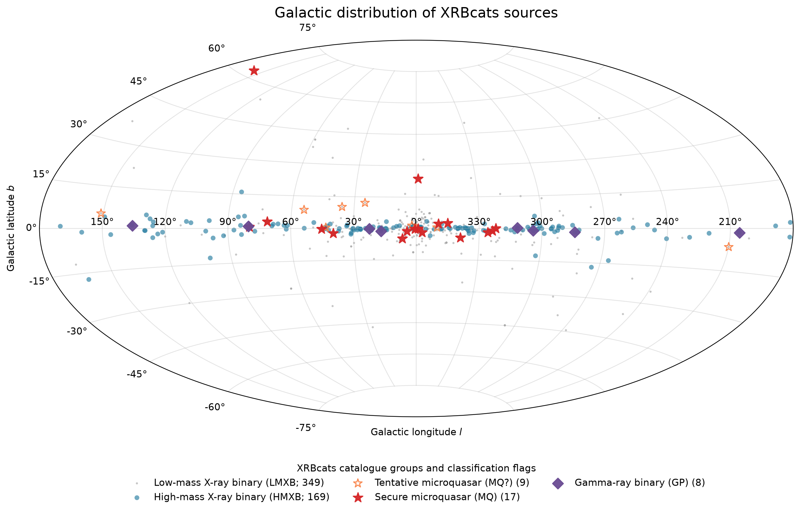
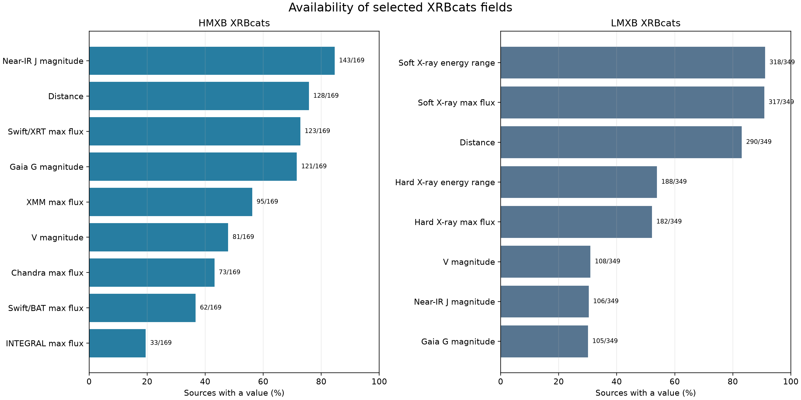
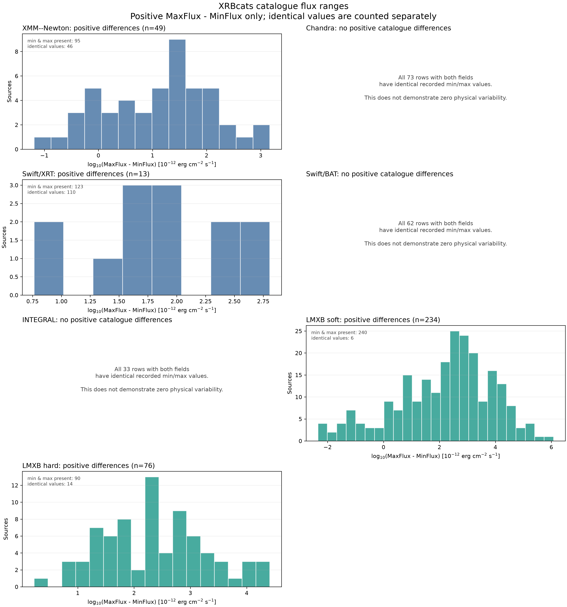
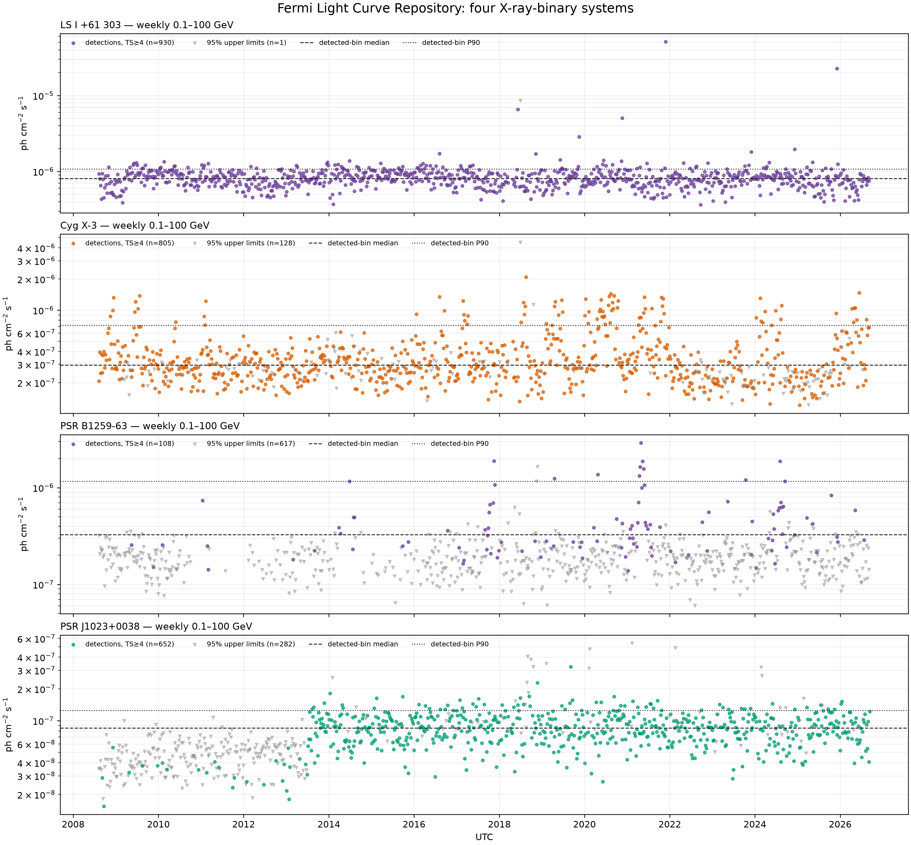
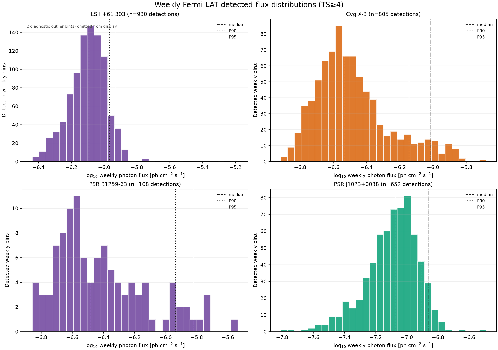
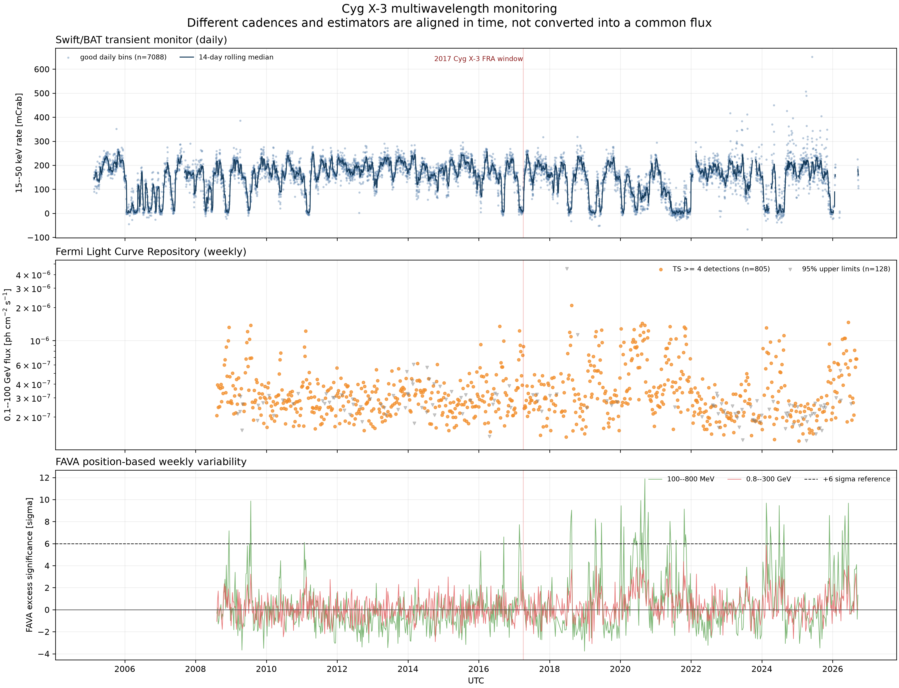

# X-ray binaries and the IceCube FRA

I am trying to figure out what makes an X-ray-binary flare unusual enough to look at more closely with IceCube's Fast Response Analysis. This is where I have got to by late September 2026. There is no finished trigger rule yet.

- **7–9 September.** I started with the 2023 XRBcats tables: 169 high-mass and 349 low-mass systems. I cleaned the catalogues, checked their class labels and made the first maps and coverage plots. They are good for finding and describing sources. They don't give a uniform history of what a normal day looks like for each binary.
- **16–17 September.** I checked the three XRB cases in the [published FRA paper](https://arxiv.org/abs/2012.04577), then worked through weekly Fermi light curves for LS I +61 303, Cyg X-3, PSR B1259-63 and PSR J1023+0038. The curves are quite different. LS I +61 303 was detected in 930 of 931 usable weeks in this export, B1259-63 in only 108 of 725. Calling B1259-63's detected-bin median its "normal" flux would be misleading. J1023 changes level around 2013, so I should split its states before assigning it one baseline.
- **23–24 September.** I tried XRBcats maximum minus minimum flux as a quick variability measure. It failed for some HMXB fields: all 73 populated Chandra pairs, 62 BAT pairs and 33 INTEGRAL pairs are identical. That says something about the catalogue fields, not that these objects were steady. I also put Cyg X-3 BAT, Fermi LCR and FAVA histories on one time axis around the 2017 FRA. Useful to look at, but I have not measured a cross-band correlation.
- I went back to the Astronomer's Telegrams for those earlier FRA cases. [ATel 10243](https://www.astronomerstelegram.org/?read=10243) reports GeV activity and the beginning of a major radio flare while Cyg X-3 was ultra-soft. [ATel 11223](https://www.astronomerstelegram.org/?read=11223) describes HESS J0632+057 near its highest observed X-ray and TeV levels, with TeV flux about twice what was typical for that orbital phase. For IGR J17591-2342, [the discovery telegram](https://www.astronomerstelegram.org/?read=11941) and [ATel 12004](https://www.astronomerstelegram.org/?read=12004) describe a new accreting-pulsar outburst and hard-X-ray re-brightening. These are different reasons an event might catch attention. The older telegrams document the observations; IceCube's precise choice of window is still partly an inference from the paper and dates.
- A later example is clearer. [IceCube's ATel 17661](https://www.astronomerstelegram.org/?read=17661) says explicitly that its January 2026 Cyg X-3 search used a two-week window to cover reported radio and gamma-ray phases. It found no significant neutrino signal (p = 1). I would like to understand whether that sort of multiwavelength context can be made quantitative for future events.

A few plots that show why I am leaning toward source-specific histories:

- **The XRBcats sky map.** Both catalogue populations sit largely along the Galactic plane; the LMXBs look more concentrated toward the centre. This is a map of catalogued sources, not a ranking for IceCube.

  

- **How much of the catalogue has usable fields?** Coverage changes a lot between instruments. A cross-source brightness comparison will select the sources with measurements, and that selection has to be shown.

  

- **The max-minus-min check.** The empty HMXB Chandra, BAT and INTEGRAL panels are the important bit. Identical catalogue entries do not prove zero physical variability. I need monitoring light curves for flare work.

  

- **Four weekly Fermi histories.** Circles are detections; grey triangles are upper limits. B1259-63 has many upper limits and J1023 changes regime around 2013. A single gamma-ray threshold would treat these sources rather strangely. Two very high LS I +61 303 bins still need a fit-quality check.

  

- **The detected-flux distributions.** Cyg X-3's detected-bin P95 is 3.29 times its median; LS I +61 303's is 1.46. B1259-63 looks broad too, but 617 of its 725 weeks are upper limits and are absent from the histogram. These numbers describe the selected detections, they are not flare thresholds. The two suspect LS I bins are omitted from this histogram display only.

  

- **Cyg X-3 in three bands/products.** The shared dates let me inspect the 2017 FRA interval. BAT gives a daily hard-X-ray rate, LCR a weekly gamma-ray photon flux or upper limit, and FAVA a weekly excess significance at the position. Peaks that seem to line up by eye still need a statistical test.

  

Next I want to mark Cyg X-3 high-state episodes in each product separately, then measure their rank, duration and fluence. I will try the same approach on B1259-63 to see how much the upper limits change the answer.

The plots use the public [XRBcats HMXB](https://doi.org/10.26093/cds/vizier.36770134) and [LMXB](https://doi.org/10.26093/cds/vizier.36750199) tables, [Fermi LCR](https://fermi.gsfc.nasa.gov/ssc/data/access/lat/lcr/), [FAVA](https://fermi.gsfc.nasa.gov/ssc/data/access/lat/FAVA/LightCurve.php) and [Swift/BAT](https://swift.gsfc.nasa.gov/results/transients/). I have left the internal IceCube material and the unpublished draft out of this shareable folder.

